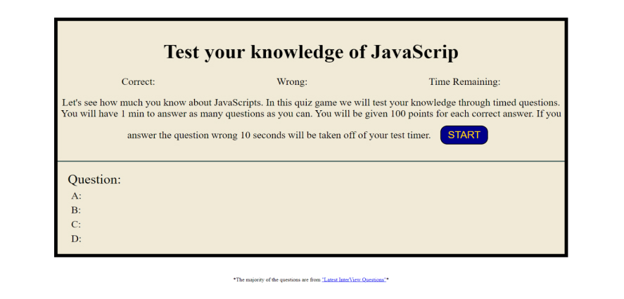
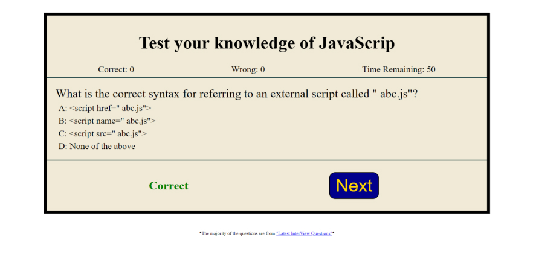
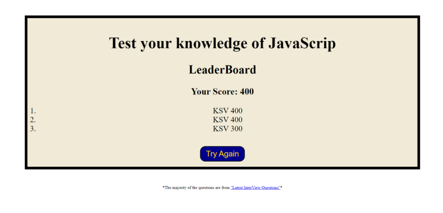

# JavaScript Quiz Game

## Overview 
This app is designed to help users practice for an interview through a javascript quiz game. 

### learning points  
- JavaScript fundamentals
- Flow control
- Prompts, alerts, and confirm functions
- Event listeners

## User Story

```
AS A coding boot camp student
I WANT to take a timed quiz on JavaScript fundamentals that stores high scores
SO THAT I can gauge my progress compared to my peers
```

## Acceptance Criteria

```
GIVEN I am taking a code quiz
WHEN I click the start button
THEN a timer starts and I am presented with a question
WHEN I answer a question
THEN I am presented with another question
WHEN I answer a question incorrectly
THEN time is subtracted from the clock
WHEN all questions are answered or the timer reaches 0
THEN the game is over
WHEN the game is over
THEN I can save my initials and my score
```

## Technologies
 
- **JavaScript**
- **HTML**
- **CSS**

## Screenshot/mockup



Main start screen

Correct answer chosen

Leader board

## CodeSnippets 
### Countdown function
``` javascript
const countdown = function () {
	timeInterval = setInterval(function () {
		if (timeLeft > 0) {
			timeLeft--;
			timer.textContent = timeLeft;
		} else {
			clearInterval(timeInterval);
		}
	}, 1000);
};
```
### Start the game over function
``` javascript
tryAgain.addEventListener('click', () => {
	correct = 0;
	wrong = 0;
	toggleMainArea();
	toggleCounterScore();
	hideDescription();
	startGame();
});
```

## License

Please refer to the LICENSE in the repo. 

## Links

### live Link
[Live website] https://kvance1010.github.io/Quiz-Game/

### All questions are from latestinterviewquestions
[resource] https://www.latestinterviewquestions.com/javascript-multiple-choice-questions-answers

### LinkedIn
[LinkedIn] https://www.linkedin.com/in/kyle-s-vance
